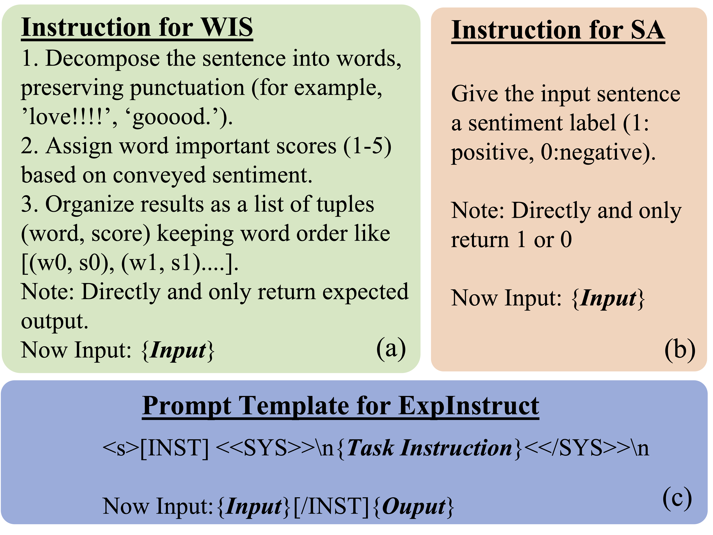
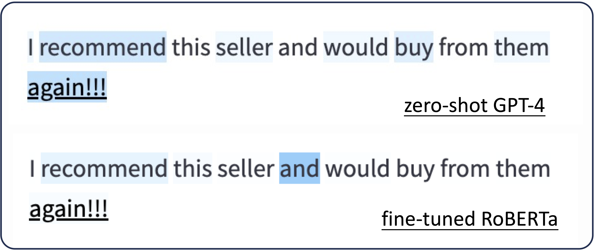
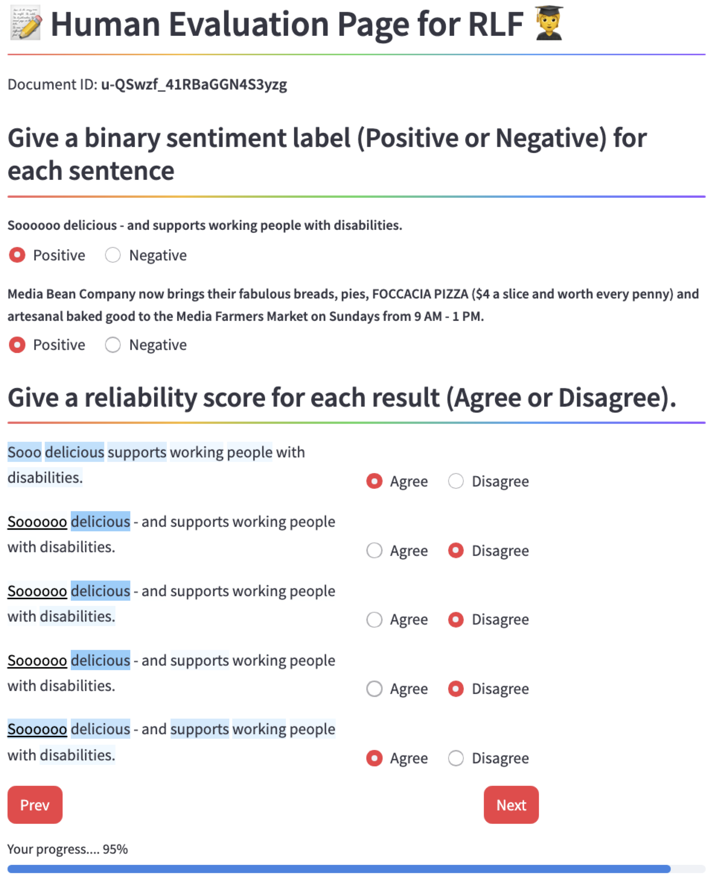

The Overlooked Repetitive Lengthening Form in Sentiment Analysis
-----------------------------
## Overview
We call attention to RLF, an expressive-valuable and prevailed but overlooked informal style. We show that RLF sentences can serve as signatures of document sentiment and have potential value for online content analysis.


*Figure 1: An overview of our framework for RLF. (1) We introduce **Lengthening** in Section 3. (2) We propose **ExpInstruct** and describe prompt details in Section 4.1. (3) Experiments details are in Section 5.*

Our contributions are as follows:
- We introduce **Lengthening**, a multi-domains dataset featuring RLFs with 850k samples grounding from 4 public datasets for SA tasks.
- We propose a cost-effective approach **ExpInstruct**, which can improve the performance and explainability of open-sourced LLMs for RLF to the same level of zero-shot GPT-4. 
- We quantify the explainability of PLMs and LLMs for RLF with a unified approach. Human evaluation demonstrates the reliability of this method.

## Data Generation Process
### Data Source
- AmazonReview-Books&Electronics: https://cseweb.ucsd.edu/~jmcauley/datasets/amazon_v2/
- Yelp-Restaurant: https://www.kaggle.com/datasets/yelp-dataset/yelp-dataset/data
- Twitter-Sentiment: https://www.kaggle.com/datasets/kazanova/sentiment140
- TripAdvisor-Hotel: http://www.cs.cmu.edu/~jiweil/html/hotel-review.html

### Code for **Lengthening** Generation
```
python ./code/data_utils.py
```
We provide sample data at ./data/sample_data.csv

## ExpInstruct
### Prompt Design for Explanation
We prompt GPT-4 with CoT to generate Word Importance Scores (WIS) to reflect word-level understanding of the input sentence.

### Instruction Template
ExpInstruct consists of two tasks with the same prompt template as shown in the figure below:


*Figure 2: Prompt Design and Template for ExpInstruct. (a) Prompt with CoT for word-level explainability. (b) Simple Prompt for SA. (c) Prompt Template for Instruction tuning*

### Code for ExpInstruct with LLaMA2
```
python ./code/ExpInstruct_LLaMA2.py
```

## A Unified Approach to Evaluate Explainability
For LLMs, we use a prompt-based method to generate WIS. For PLMs, we choose a saliency-based method to generate WIS. Specifically, we use the occlusion-based method.
To eliminate the barrier caused by differing relative WIS values across models, we apply min-max followed by \( L_1 \) normalization to WIS as show in Figure 3.


*Figure 3: Comparing normalized WIS for an RLF sentence from zero-shot GPT-4 and fine-tuned RoBERTa.*

### Code for the Unified Approach to Evaluate Explainability
```
./code/Unified_Exp_eval.ipynb
```

## Human Evaluation
We conduct human evaluation to assess potential errors in our methodology.
**Task 1** - Annotation for Sentiment Label: Give a sentence (RLF or w/o RLF). Annotators need to give a binary sentiment label (1: Positive, 0: Negative).
**Task 2** - Annotation for Explanation Reliability: Annotators need to give the reliability score for each result (1: Agree, 0: Disagree).
We customized our annotation page with streamlit.


*Figure 4: Our customized user interface for human evaluation. Annotators are asked to do two tasks: annotation for sentiment labels and explanation reliability.*

### Code for customized user interface for human evaluation
```
streamlit run ./code/human_eval_page.py
```


